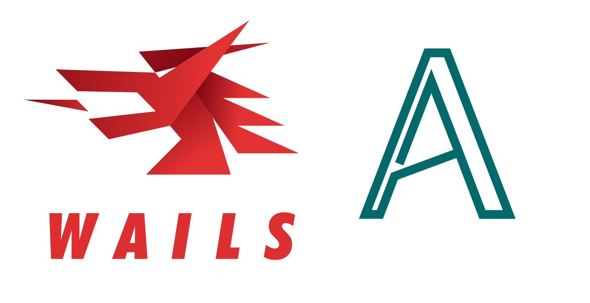

# README



## About

A template for [Wails](https://wails.io/) with [Actify](https://actifyjs.com/).

## Creating the Projekt

Create a new Application with the Wails CLI and this template:

```
wails init -n projectname -t https://github.com/actifyjs/wails-template-actify
```

## Running the Application in Developer Mode

The easiest way is to use the Wails CLI: `wails dev`

This should hot refresh when making changes the Frontend and rebuild when making changes in the Go.

## Building the Application for Production

You can build you Application with: `wails build`
